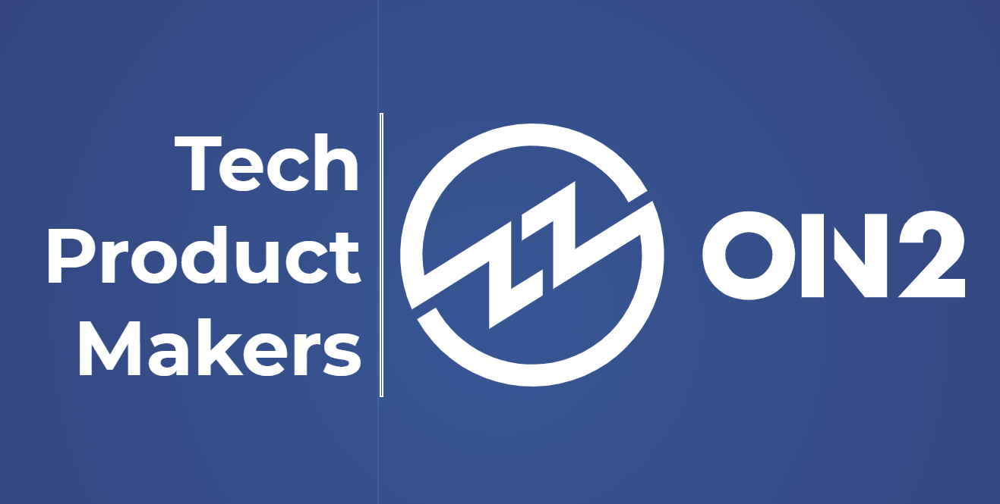

## Hi, we are On2 👋

On2 is Brazilian software house that helps companies to build their products using bleeding-edge technologies.

### 💻 Technology as a cornerstone
Technology is the foundation for innovation.  
Connected with current trends in the digital environment, we transform challenges into business opportunities by developing solutions that involves the most advanced technologies available on the market.  
We are specialists in developing bleeding-edge, Web, open-source and open-standard technologies.

### 🚀 Focus on the product
Good ideas turned into market value.  
Our job is to bring projects to life by creating technological products with high perceived value.  
Our team has extensive experience in product development. Count on our team from conception to deployment in production. We participate, organize and manage the project from start to finish, letting the client focus on the business.

### ⚙️ Specialists
We make everything work at the best cost, in the shortest time.  
We use advanced software techniques, conducted by recognized and experienced professionals.  
The maker culture is present and rooted in our team. We love solving problems of any kind, and not only that, we love proposing solutions to difficult problems.

### 📧 Get in touch
You can get in touch with us on contato[at]on2.dev  
Our blog: https://blog.on2.dev/  
Our Linkedin: https://www.linkedin.com/company/on2/  

### 🗺️ Where we are
Porto Alegre, Rio Grande do Sul, Brazil  
Av. Dr. Nilo Peçanha, 1500, Sala 16  
Boa Vista, Porto Alegre - RS  
CEP 91.330-002
